# 09. Web UI

Web UI работает через тот же REST API, что CLI, TUI и интеграции: всё, что сделано здесь
мышкой, можно повторить командой `mp`, и наоборот. Интерфейс на русском и английском, со
светлой и тёмной темой; на телефоне меню выезжает сбоку, а таблицы становятся карточками.
Долгие операции — установка пакетов, применение конфигов, выпуск сертификатов, бэкапы —
идут задачами: страница не ждёт, прогресс и лог видны в «Задачах».

Скриншоты сняты с примерного сервера — Ubuntu 24.04, MonoPanel 0.8.10, сайты на
example.com. Как их переснять — [в конце страницы](#как-переснять-скриншоты).

## Вход

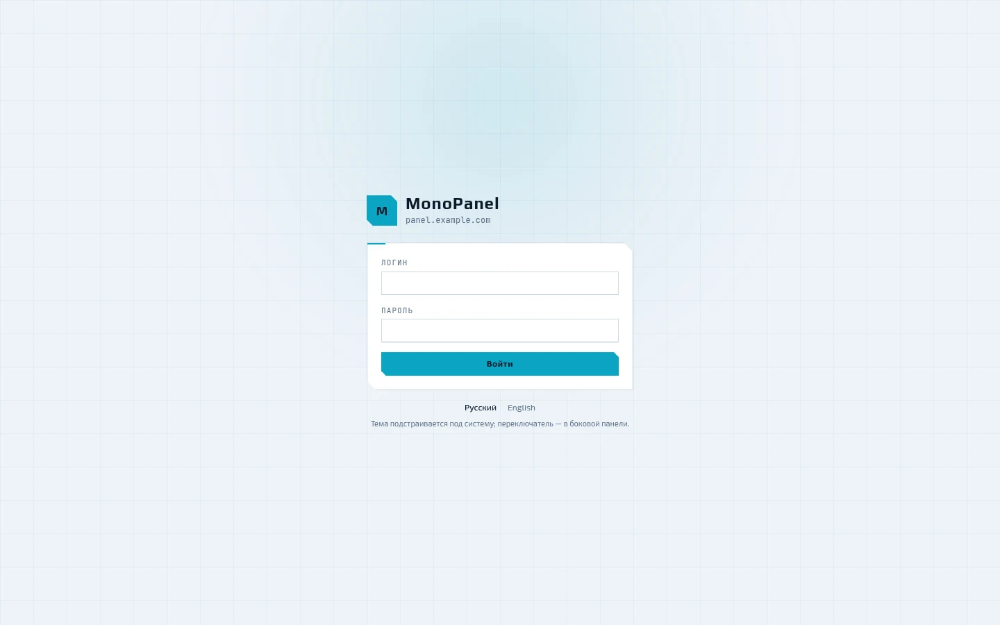

Панель слушает свой порт — 8443 — со своим сертификатом и не зависит от системного nginx.
Язык переключается прямо на экране входа, тема повторяет системную. Если у аккаунта
включена двухфакторная аутентификация, после пароля панель спросит код из приложения.

## Дашборд

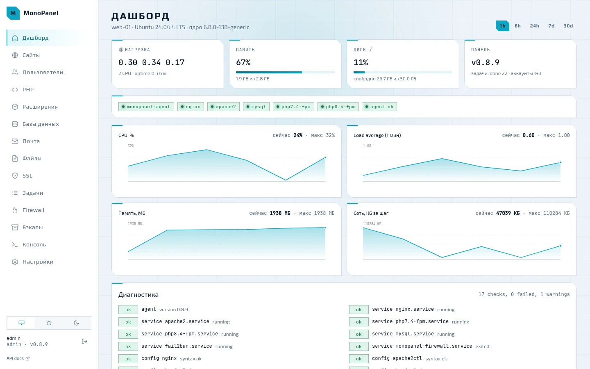

Нагрузка, память, диск и версия панели, ниже — состояние сервисов и графики CPU, load
average, памяти и сети за час, шесть часов, сутки, неделю или месяц. Внизу — диагностика,
то же, что `mp doctor`: сервисы, синтаксис конфигов, диск, память, сертификаты, DNS,
задачи и дрейф сгенерированных файлов. У части находок рядом есть кнопка «починить».

## Сайты

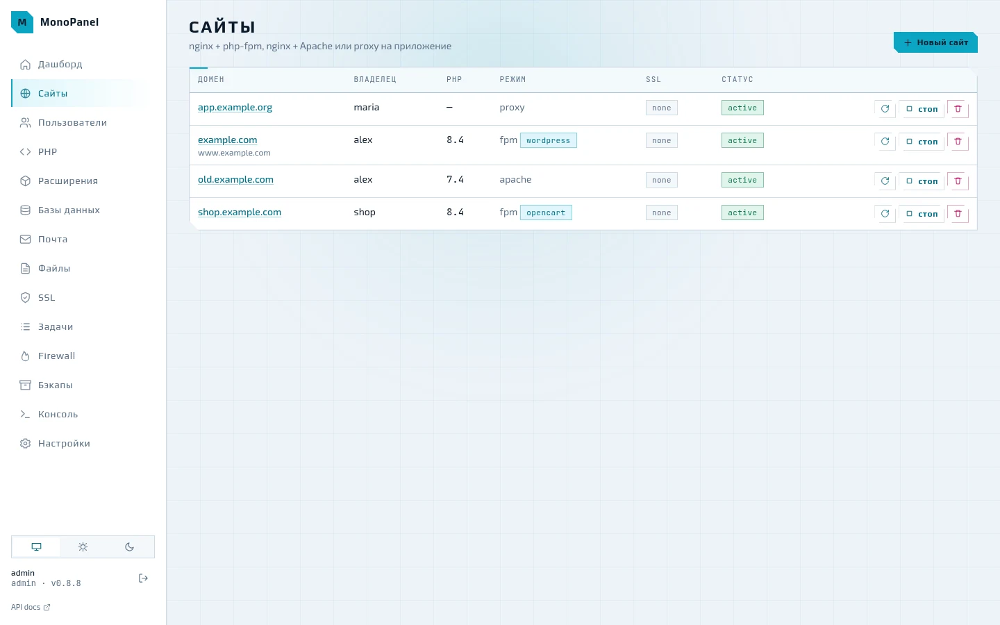

В списке — владелец, ветка PHP, режим и пресет CMS, SSL и статус. Сайт можно применить
заново, приостановить — вместо него отдаётся страница 503 — и удалить.

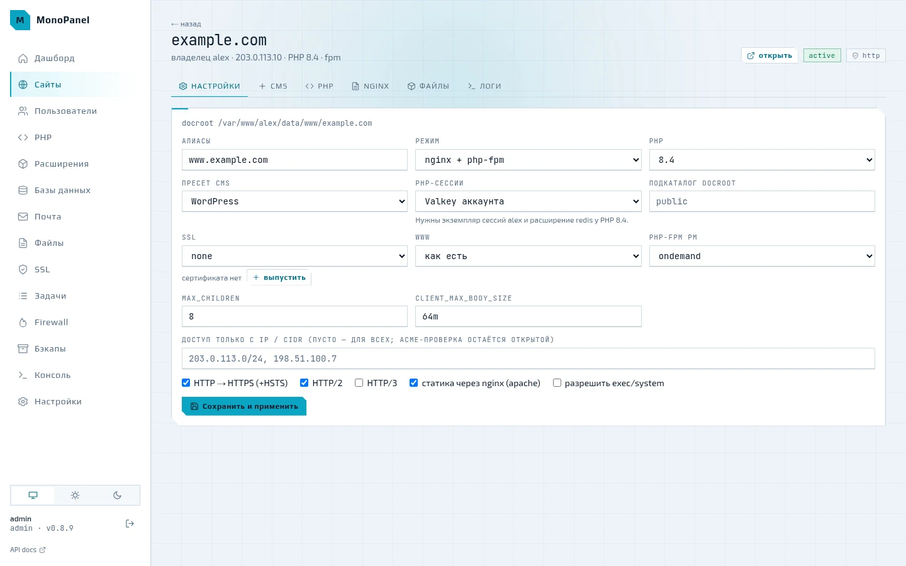

Карточка сайта — вкладки «Настройки», «CMS», «PHP», «nginx», «Файлы» и «Логи». В
настройках — алиасы, режим (nginx → php-fpm, nginx → Apache или прокси на приложение),
ветка PHP, пресет CMS, где PHP хранит сессии (файлы или Valkey аккаунта), подкаталог
docroot, SSL, редирект www, пул php-fpm, доступ только с перечисленных IP и флаги HTTP/2,
HTTP/3 и HSTS. «Сохранить и применить» ставит задачу:
конфиги рендерятся заново, проверяются `nginx -t`, `apachectl -t` и `php-fpm -t` и
записываются все сразу — или не записываются вовсе, если проверка не прошла.

## PHP

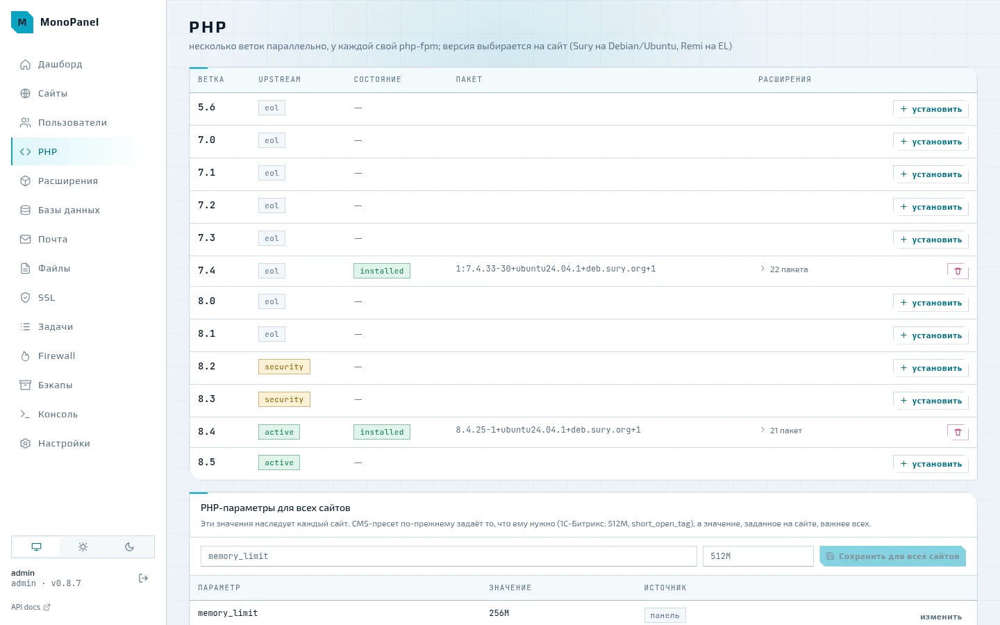

Все ветки от 5.6 до 8.5 с их статусом у разработчиков PHP — eol, security, active. У
установленной ветки раскрывается список расширений, их можно включать и выключать. Ниже —
PHP-параметры для всех сайтов: значение наследует каждый сайт, пресет CMS задаёт то, что
нужно ему, а заданное на самом сайте важнее всего.

## Расширения

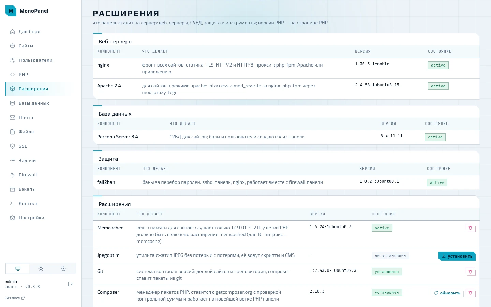

Всё, что панель ставит на сервер помимо PHP: nginx и Apache, Percona Server или MySQL,
fail2ban, memcached, Valkey, jpegoptim, git, composer и Sphinx для 1С-Битрикс — с версией,
состоянием службы и кнопками установки; инструменты можно и удалить. У memcached здесь же
настраиваются память и число соединений.

## Базы данных

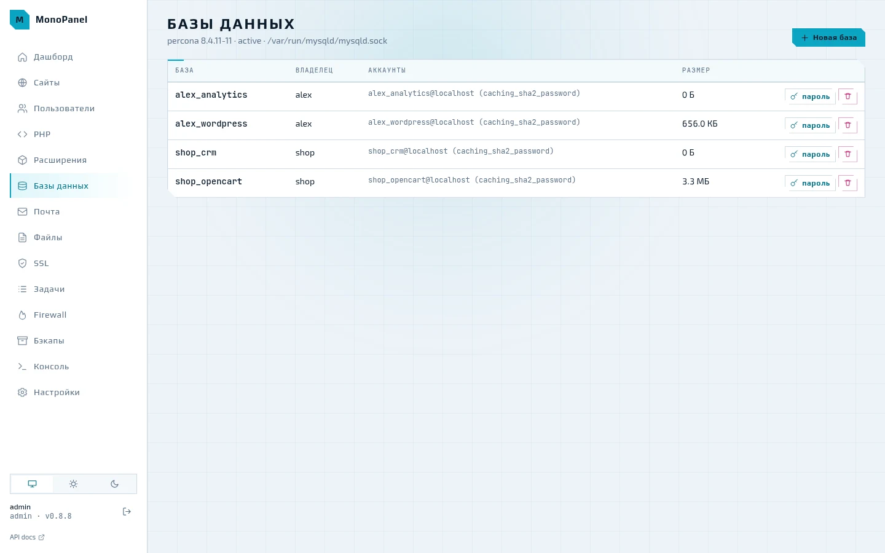

Базы называются `<логин>_<имя>`, у каждой свой пользователь MySQL. Пароль генерируется
так, чтобы пройти `validate_password`, и меняется прямо из списка. Над таблицей — какая
СУБД стоит и где её сокет.

## Почта

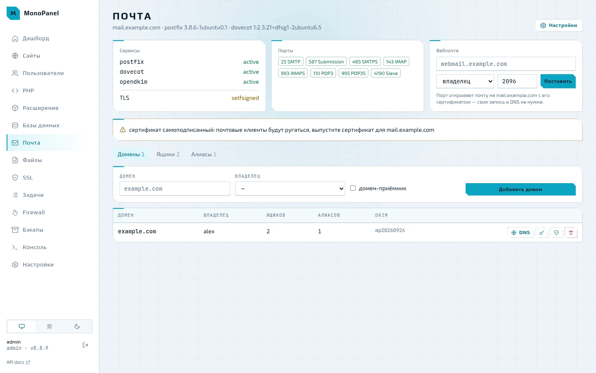

Состояние postfix, dovecot и opendkim, открытые порты, вебпочта Roundcube, домены, ящики и
алиасы. Кнопка DNS у домена показывает, какие MX, SPF, DKIM, DMARC и PTR прописать, и
проверяет их по публичным резолверам. Если почтовый сервер работает на самоподписанном
сертификате, панель об этом предупреждает. Подробнее — [06. Почтовый сервер](06-mail.md).

## Файлы

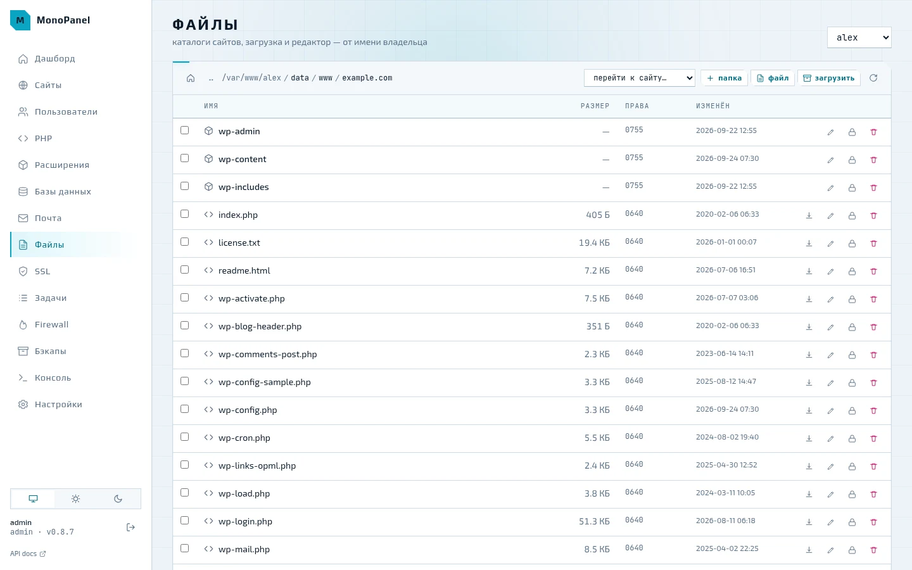

Файлы открываются от имени владельца: панель видит в них ровно то же, что и он сам.
Загрузка перетаскиванием, папки, права, распаковка архивов; на странице сайта вкладка
«Файлы» сразу открывает его docroot.

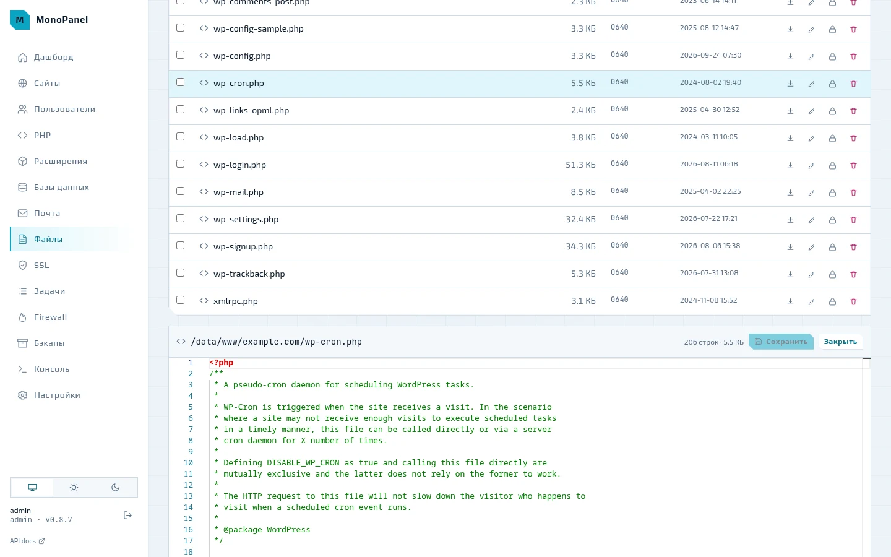

Текстовый файл открывается в редакторе VS Code (Monaco): подсветка php, html, css, js, sql,
yaml и ini, поиск и замена, мультикурсор, свёртка, палитра команд по F1.

## Задачи

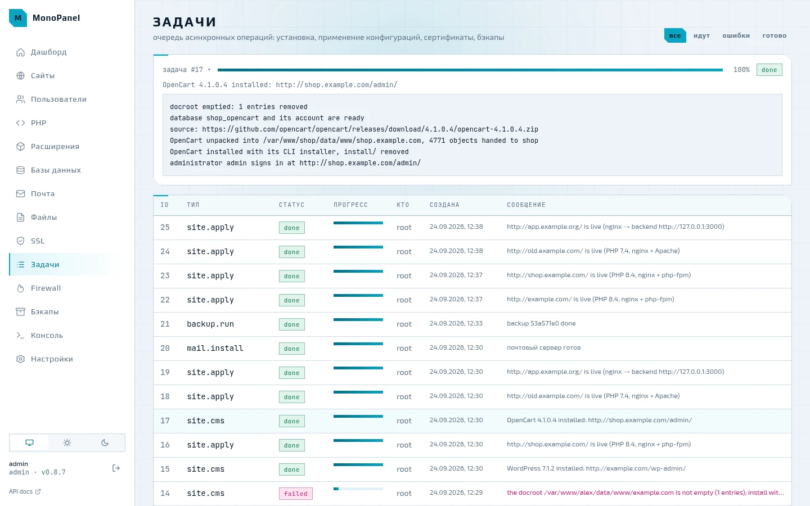

Всё, что меняет сервер, идёт очередью задач: установка пакетов, применение сайтов, выпуск
сертификатов, бэкапы. По клику открывается лог задачи — живой, пока она идёт; упавшая
задача остаётся в списке с текстом ошибки.

## Firewall

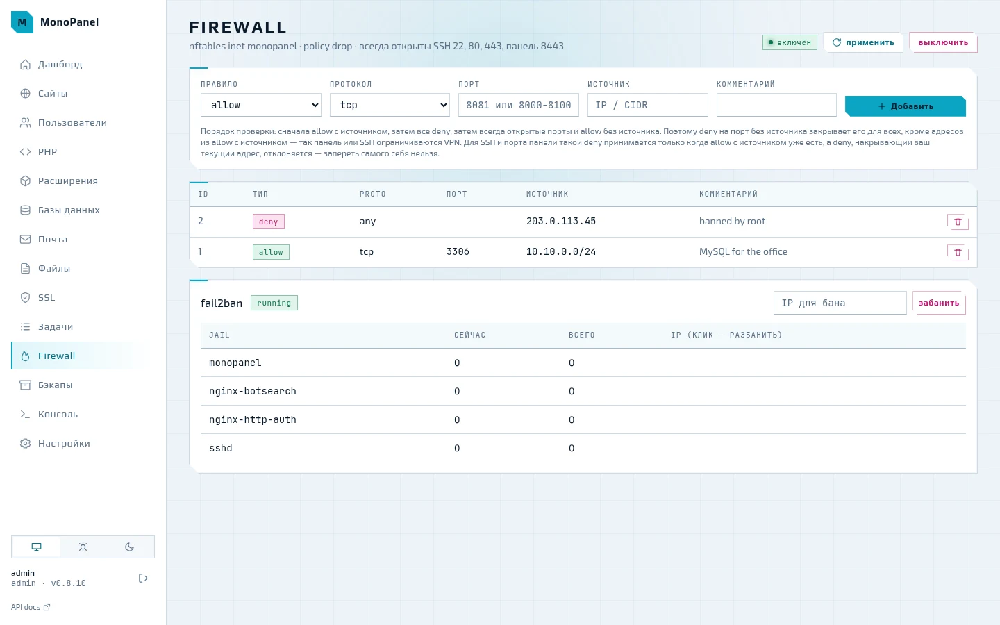

Правила nftables поверх политики drop, SSH, 80, 443 и порт панели открыты всегда. Правила
allow с источником проверяются раньше deny, поэтому порт можно закрыть для всех, кроме
своей сети или VPN, а правило, которое заперло бы вас самих, панель не примет. Ниже —
jail'ы fail2ban и их баны, адрес снимается с бана кликом.

## Бэкапы

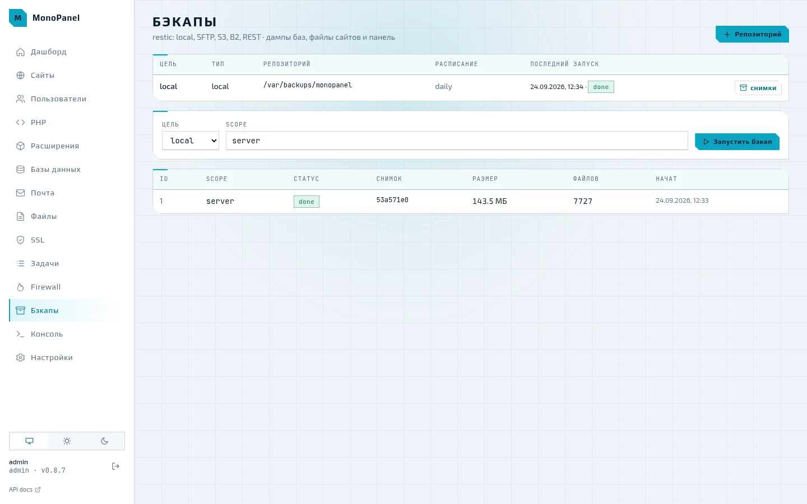

Репозитории restic — локальный каталог, SFTP, S3, B2 или REST-сервер — с ежедневным
расписанием и хранением по дням, неделям и месяцам. Бэкап запускается на весь сервер,
аккаунт, сайт или базу; снимок восстанавливается рядом, в `<data>/restore/<снимок>`, или
на место.

## Пользователи

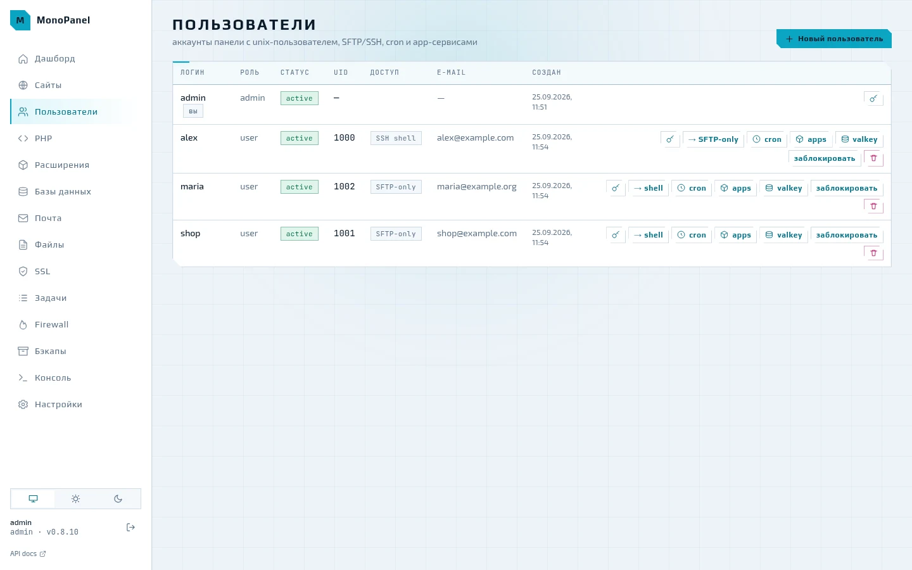

Аккаунт панели — это unix-пользователь со своим домашним каталогом: доступ по SFTP
(chroot) или SSH, задания cron и app-сервисы — фоновые приложения вроде бота или бэкенда на
Node и Python под systemd. Пароль общий для панели и SFTP. Удаление аккаунта убирает и его
сайты, базы, cron, экземпляры Valkey и сертификаты.

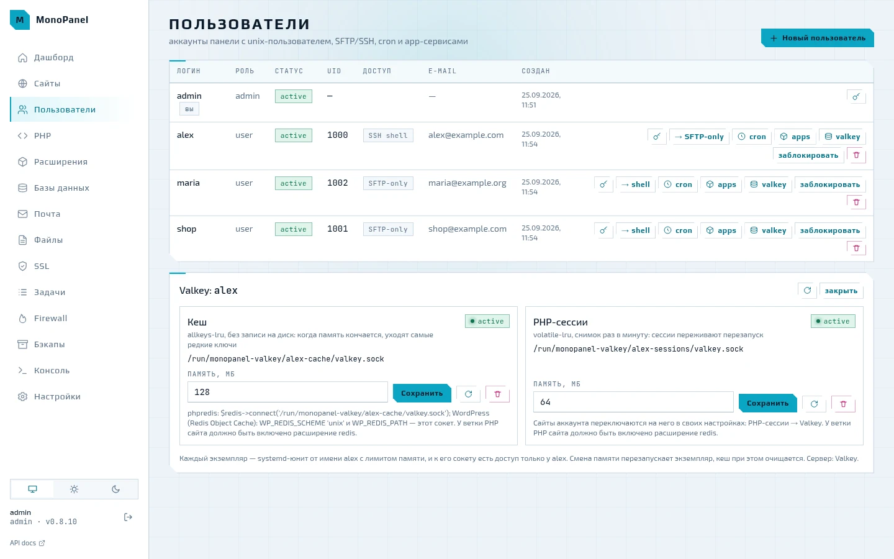

Кнопка valkey открывает два экземпляра Valkey аккаунта — для кеша и для PHP-сессий. Каждый
работает от имени аккаунта с лимитом памяти и слушает только свой unix-сокет: путь и
подсказка, как подключить phpredis или WordPress, показаны тут же. Сайт переводит сессии в
Valkey у себя в настройках — поле «PHP-сессии».

## Настройки

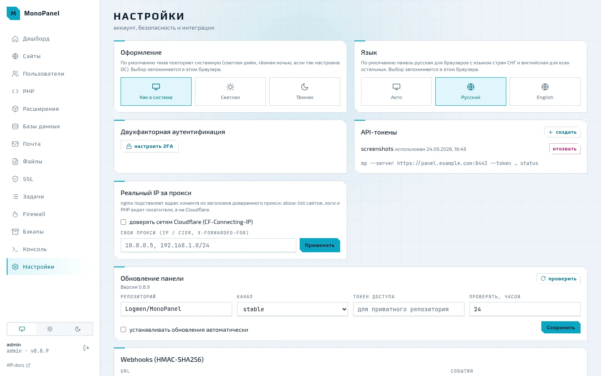

Тема и язык, двухфакторная аутентификация с QR-кодом для приложения, API-токены для CLI и
интеграций, доверенные прокси для настоящего адреса посетителя (сети Cloudflare
встроены), обновление панели и webhooks с подписью HMAC-SHA256.

## Как переснять скриншоты

Скриншоты снимаются с настоящей панели на машине [площадки](08-testbed.md), наполненной
примерными данными: `scripts/screenshots/seed.sh` ставит последний релиз той же командой,
что и в README, поднимает стек и заводит аккаунты, сайты с WordPress и OpenCart, базы,
cron, почту, firewall и бэкап на example.com; адреса сайтов — из диапазона для
документации. `scripts/screenshots/capture.mjs` открывает панель в headless Chrome по
временному API-токену и снимает каждую страницу в светлой и тёмной теме в `docs/img/`;
с `--lang en` — английский интерфейс в `docs/en/img/` для английской документации.

```bash
make testbed-reset VM=ubuntu2404
ssh mp-ubuntu2404 sh -s < scripts/screenshots/seed.sh
node scripts/screenshots/capture.mjs --ssh mp-ubuntu2404          # все страницы
node scripts/screenshots/capture.mjs --ssh mp-ubuntu2404 jobs     # только одну
node scripts/screenshots/capture.mjs --lang en --ssh mp-ubuntu2404  # английские
```

Рядом с каждым снимком лежит тёмный вариант (`<имя>.dark.webp`): на сайте документации
показывается тот, что совпадает с выбранной темой, на GitHub — светлый.
