# 09. Web UI

The web UI works through the same REST API as the CLI, the TUI and integrations: anything
done here with the mouse can be repeated with an `mp` command, and vice versa. The
interface is in English and Russian, with a light and a dark theme; on a phone the menu
slides in from the side and tables become cards. Long operations — installing packages,
applying configs, issuing certificates, backups — run as jobs: the page does not wait, and
the progress and the log are visible in "Jobs".

The screenshots were taken on a sample server — Ubuntu 24.04, MonoPanel 0.8.10, sites on
example.com. How to retake them: [at the end of the page](#how-to-retake-the-screenshots).

## Sign-in

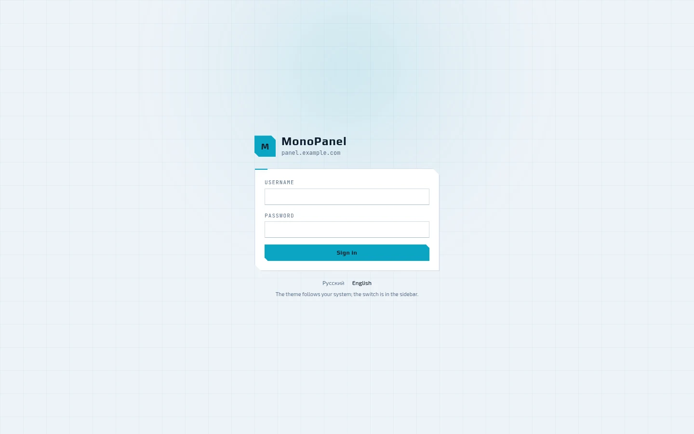

The panel serves its own port — 8443 — with its own certificate and does not depend on the
system nginx. The language can be switched right on the sign-in screen, and the theme
follows the system one. If two-factor authentication is enabled for the account, the panel
asks for the code from the authenticator app after the password.

## Dashboard

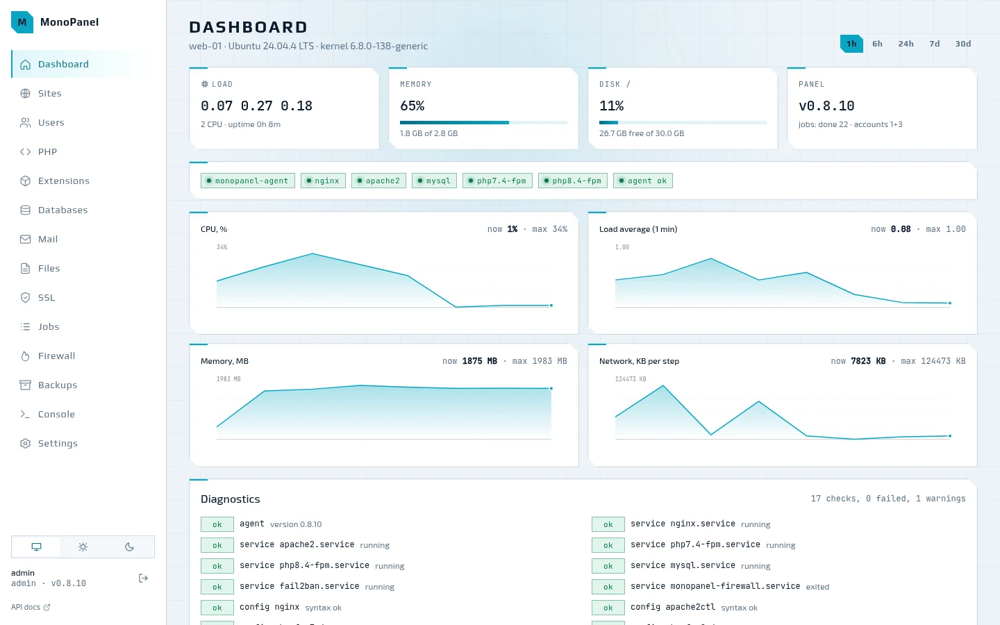

Load, memory, disk and the panel version; below them, the state of the services and charts
of CPU, load average, memory and network over an hour, six hours, a day, a week or a
month. At the bottom are the diagnostics, the same as `mp doctor`: services, config
syntax, disk, memory, certificates, DNS, jobs and drift of generated files. Some findings
have a "Fix" button next to them.

## Sites

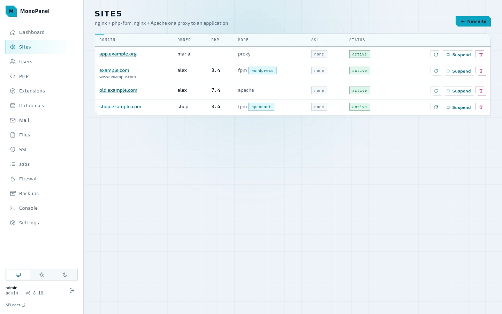

The list shows the owner, the PHP branch, the mode and CMS preset, SSL and the status. A
site can be applied again, suspended — a 503 page is served in its place — and deleted.

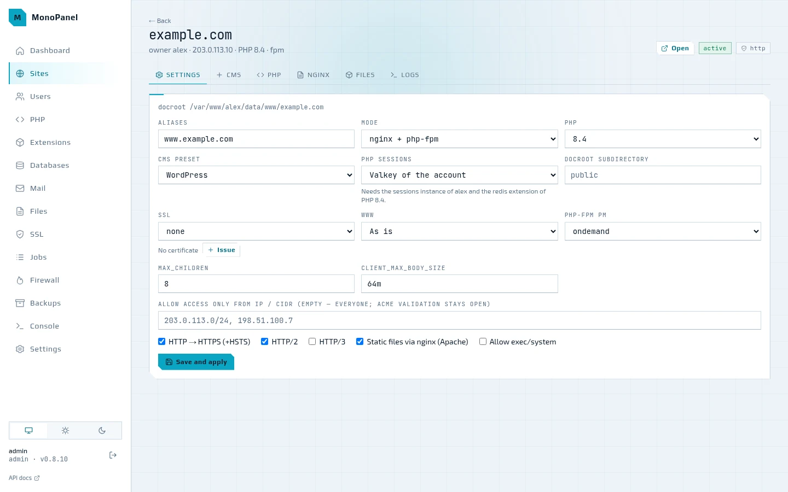

The site page has the "Settings", "CMS", "PHP", "nginx", "Files" and "Logs" tabs. The
settings cover the aliases, the mode (nginx → php-fpm, nginx → Apache or a proxy to an
application), the PHP branch, the CMS preset, where PHP keeps sessions (files or the
account's Valkey), the docroot subdirectory, SSL, the www redirect, the php-fpm pool,
access only from the listed IPs and the HTTP/2, HTTP/3 and HSTS flags. "Save and apply"
queues a job: the configs are rendered again, checked with `nginx -t`, `apachectl -t` and
`php-fpm -t` and written all at once — or not written at all if the check fails.

## PHP

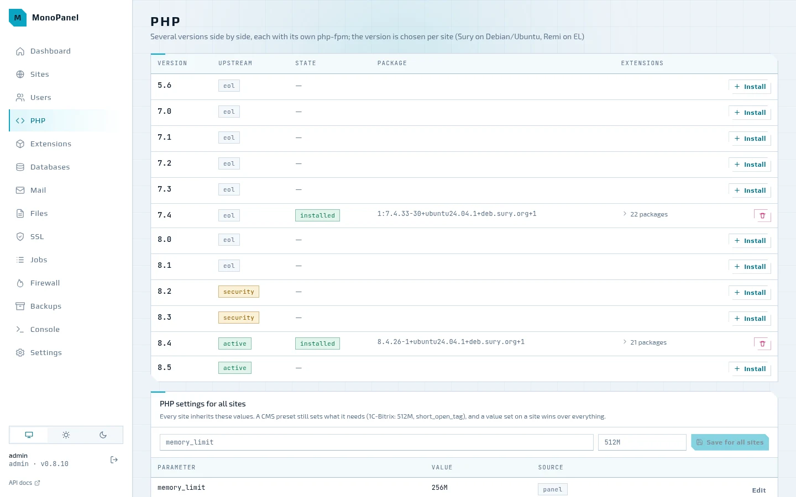

Every branch from 5.6 to 8.5 with its status from the PHP developers — eol, security,
active. An installed branch expands into its list of extensions, which can be switched on
and off. Below are the PHP settings for all sites: every site inherits these values, a CMS
preset sets what it needs, and a value set on the site itself wins over everything.

## Extensions

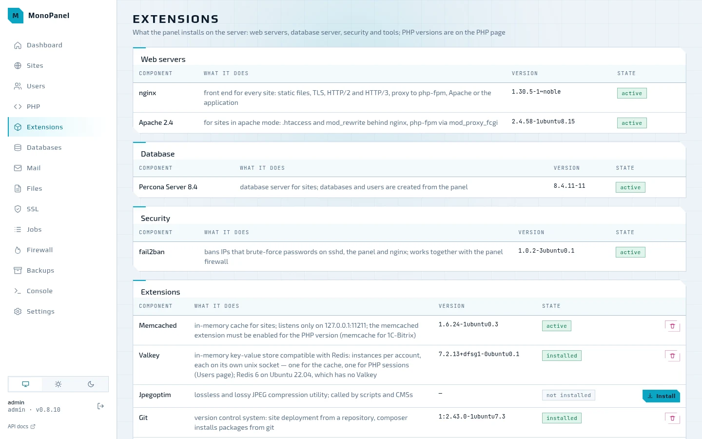

Everything the panel installs on the server besides PHP: nginx and Apache, Percona Server
or MySQL, fail2ban, memcached, Valkey, jpegoptim, git, composer and Sphinx for 1C-Bitrix —
with the version, the service state and install buttons; the tools can also be removed.
The memory and the number of connections for memcached are set here as well.

## Databases

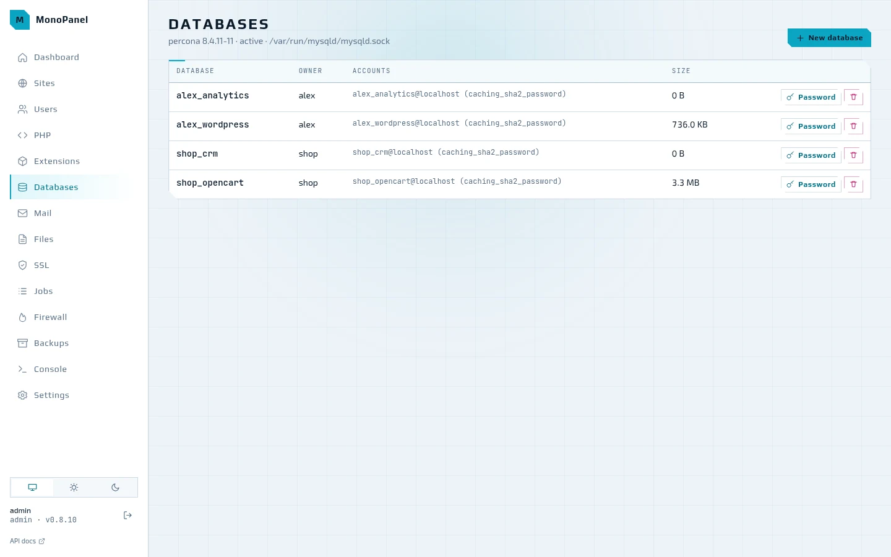

Databases are named `<login>_<name>`, and each has its own MySQL user. The password is
generated so that it passes `validate_password` and can be changed right from the list.
Above the table: which database server is installed and where its socket is.

## Mail

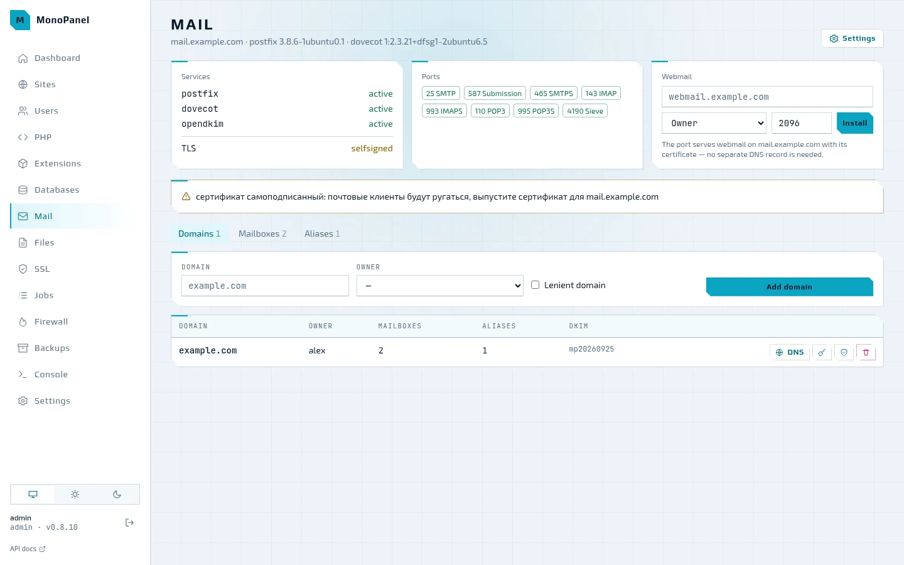

The state of postfix, dovecot and opendkim, open ports, Roundcube webmail, domains,
mailboxes and aliases. A domain's DNS button shows which MX, SPF, DKIM, DMARC and PTR
records to publish and checks them against public resolvers. If the mail server runs on a
self-signed certificate, the panel warns about it. More in [06. Mail server](06-mail.md).

## Files

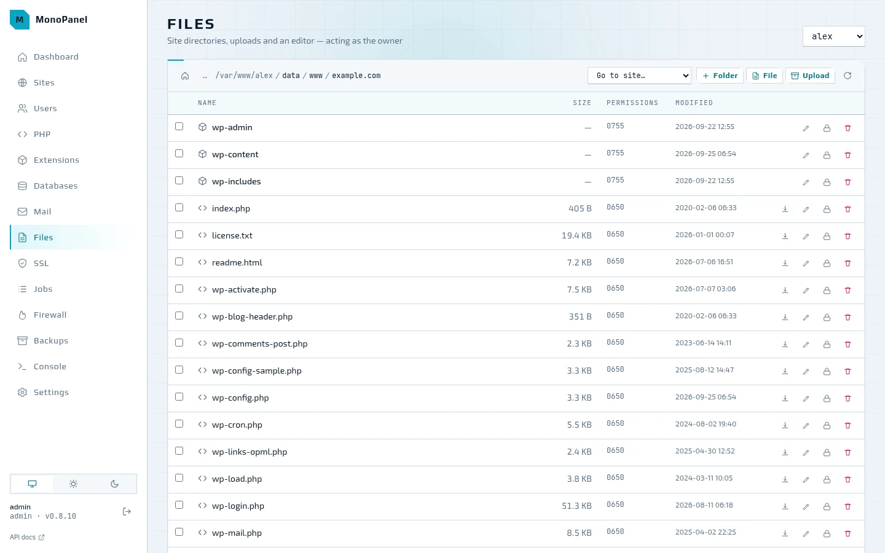

Files are opened as their owner: the panel sees in them exactly what the owner sees.
Drag-and-drop upload, folders, permissions, archive extraction; on a site's page the
"Files" tab opens straight at its docroot.

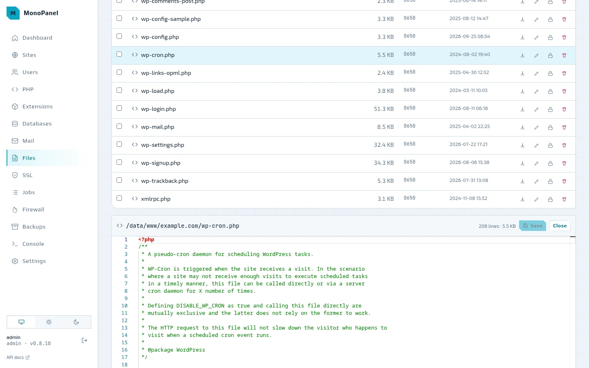

A text file opens in the VS Code editor (Monaco): highlighting for php, html, css, js,
sql, yaml and ini, find and replace, multiple cursors, folding, the command palette on F1.

## Jobs

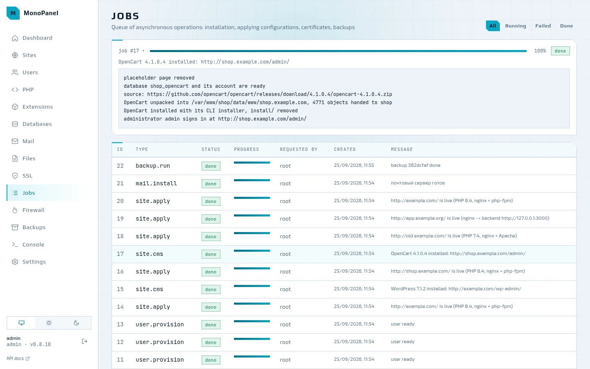

Everything that changes the server goes through the job queue: installing packages,
applying sites, issuing certificates, backups. A click opens the job's log — live while
the job runs; a failed job stays in the list with its error text.

## Firewall

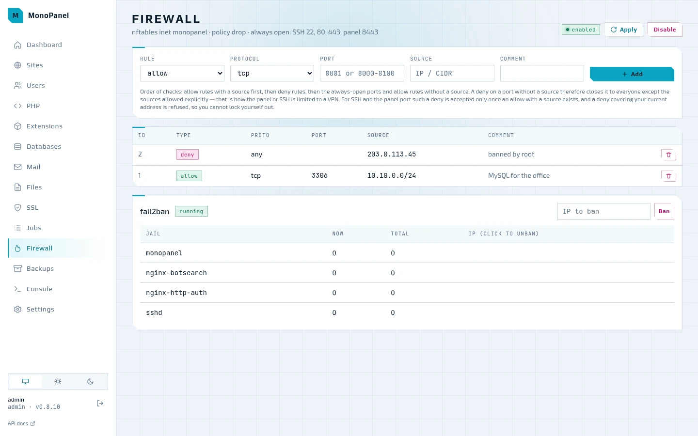

Firewall rules in nftables on top of a drop policy; SSH, 80, 443 and the panel port are
always open. Allow rules with a source are checked before deny rules, so a port can be
closed to everyone except your own network or VPN, and the panel will not accept a rule
that would lock you out. Below are the fail2ban jails and their bans; an address is
unbanned with a click.

## Backups

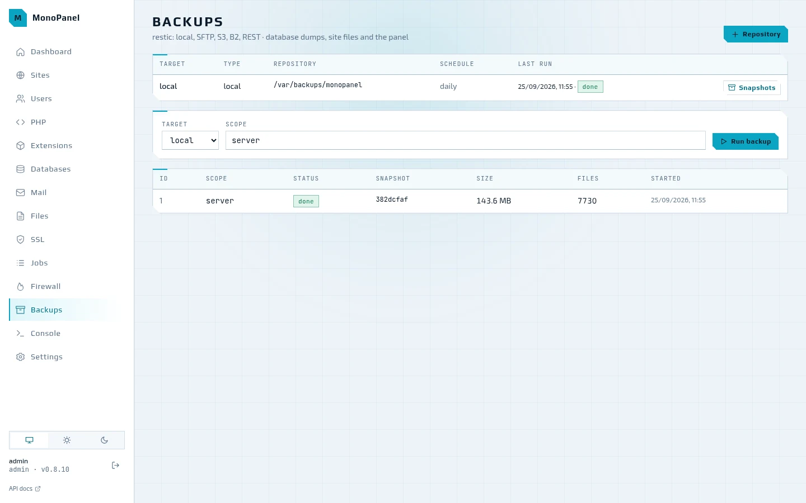

Backups go to restic repositories — a local directory, SFTP, S3, B2 or a REST server —
with a daily schedule and retention by days, weeks and months. A backup can be run for the
whole server, an account, a site or a database; a snapshot is restored alongside, into
`<data>/restore/<snapshot>`, or in place.

## Users

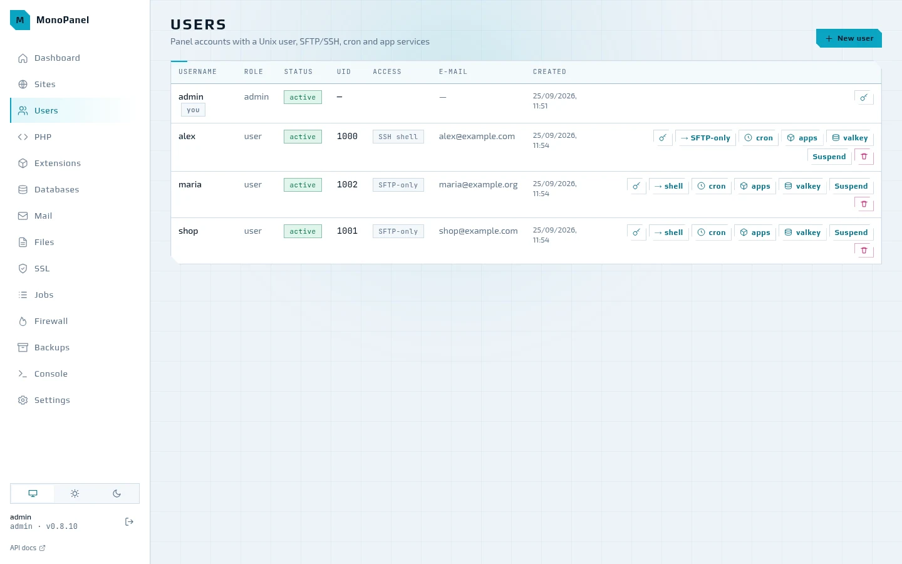

A panel account is a unix user with its own home directory: SFTP (chroot) or SSH access,
cron jobs and app services — background applications such as a bot or a Node or Python
backend under systemd. The panel and SFTP share one password. Deleting an account also
removes its sites, databases, cron, Valkey instances and certificates.

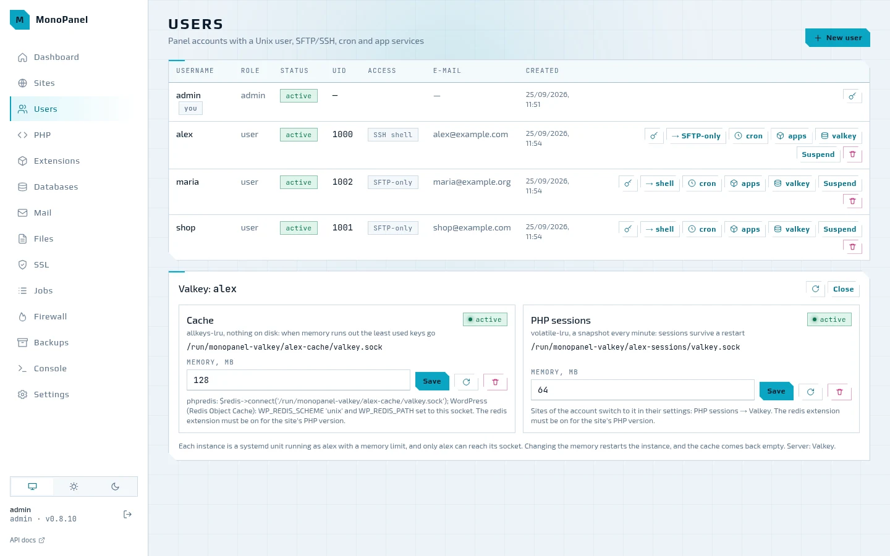

The valkey button opens the account's two Valkey instances — one for the cache and one for
PHP sessions. Each runs as the account with a memory limit and listens only on its own
unix socket: the path and a hint on how to connect phpredis or WordPress are shown right
there. A site moves its sessions to Valkey in its own settings — the "PHP sessions" field.

## Settings

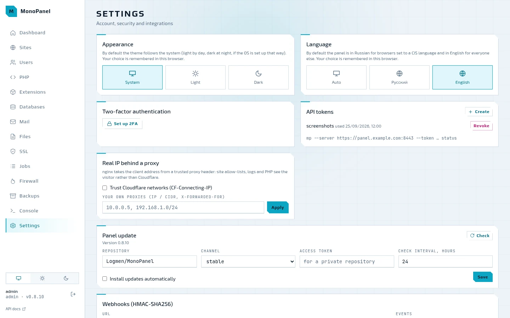

Theme and language, two-factor authentication with a QR code for the authenticator app,
API tokens for the CLI and integrations, trusted proxies for the visitor's real address
(Cloudflare's networks are built in), the panel update and webhooks signed with
HMAC-SHA256.

## How to retake the screenshots

The screenshots are taken from a real panel on a [testbed](08-testbed.md) machine filled
with sample data: `scripts/screenshots/seed.sh` installs the latest release with the same
command as in the README, brings up the stack and creates accounts, sites with WordPress
and OpenCart, databases, cron, mail, the firewall and a backup on example.com; the site
addresses come from the range reserved for documentation.
`scripts/screenshots/capture.mjs` opens the panel in headless Chrome with a temporary API
token and captures every page in the light and the dark theme into `docs/img/`; with
`--lang en`, the English interface goes into `docs/en/img/` for the English documentation.

```bash
make testbed-reset VM=ubuntu2404
ssh mp-ubuntu2404 sh -s < scripts/screenshots/seed.sh
node scripts/screenshots/capture.mjs --ssh mp-ubuntu2404          # all pages
node scripts/screenshots/capture.mjs --ssh mp-ubuntu2404 jobs     # just one
node scripts/screenshots/capture.mjs --lang en --ssh mp-ubuntu2404  # English
```

Next to each screenshot lies its dark variant (`<name>.dark.webp`): the documentation site
shows the one that matches the selected theme, GitHub shows the light one.
